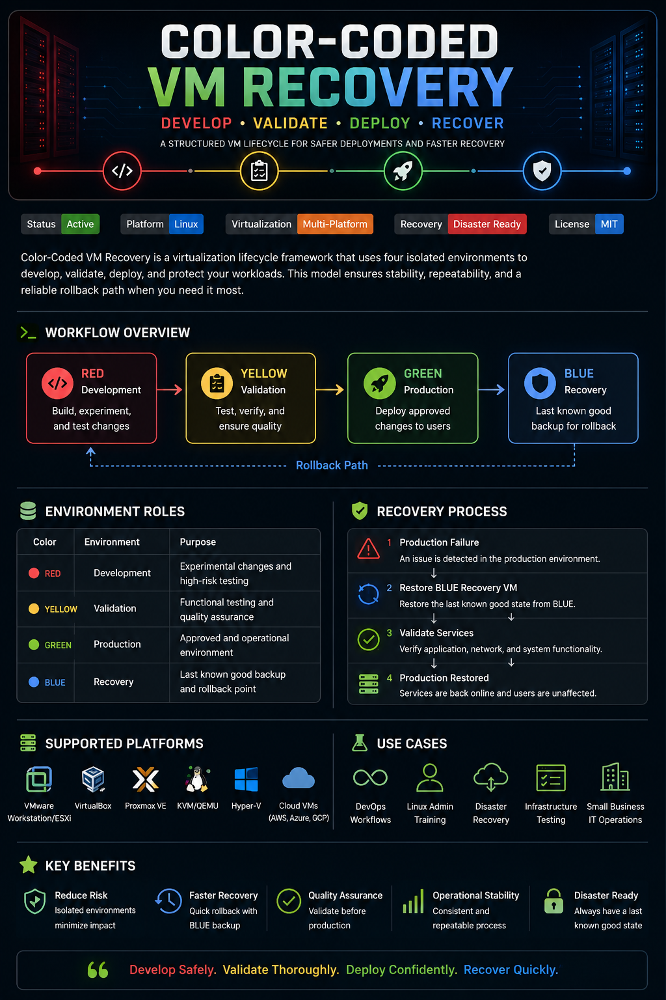
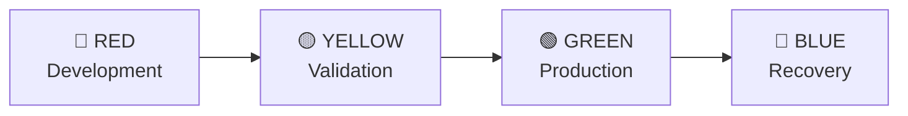

# Color-Coded VM Recovery



> A structured virtualization lifecycle framework for development, validation, production, and disaster recovery environments.

> 💡 Inspired by enterprise change management and blue-green deployment strategies used in modern infrastructure environments.


---

## Overview

Color-Coded VM Recovery is a visual infrastructure framework that organizes virtual machines into dedicated lifecycle stages. By separating development, validation, production, and recovery environments, organizations can reduce deployment risk, improve operational consistency, and maintain a rapid rollback strategy.

This approach is suitable for home labs, Linux administration training, infrastructure engineering, disaster recovery planning, and DevOps learning environments.

---

## 🔄 Environment Lifecycle



---

## 🎨 Environment Roles

| Color     | Environment | Purpose                                            |
| --------- | ----------- | -------------------------------------------------- |
| 🔴 Red    | Development | Build, test, and experiment with new changes       |
| 🟡 Yellow | Validation  | Verify functionality and perform quality assurance |
| 🟢 Green  | Production  | Approved and operational environment               |
| 🔵 Blue   | Recovery    | Protected rollback and disaster recovery state     |

---

## 🛡️ Key Benefits

### 🔒 Environment Separation

Maintain isolated environments to prevent development changes from impacting production.

### ✅ Safer Deployments

Validate functionality before promoting workloads to production.

### 🔄 Rapid Rollback

Quickly restore services using a protected recovery environment.

### 📈 Operational Consistency

Follow a repeatable lifecycle that improves reliability and documentation.

### ☁️ Disaster Recovery Readiness

Maintain a known-good recovery state for business continuity.

### 🎓 Training Friendly

Perfect for homelabs, certification studies, and portfolio projects.

---

## 🚨 Recovery Process

When production issues occur, the recovery workflow provides a structured path back to service.

```text
Production Failure
        ↓
Restore BLUE Recovery VM
        ↓
Validate Services
        ↓
Production Restored
```

### Recovery Steps

1. Detect production failure
2. Stop affected services
3. Restore BLUE recovery environment
4. Validate application and network functionality
5. Return services to production

---

## 🖥️ Example Environment Naming

```text
linux-dev-red
linux-stage-yellow
linux-prod-green
linux-dr-blue
```

---

## ⚙️ Supported Platforms

* VMware Workstation
* VMware ESXi
* VirtualBox
* Proxmox VE
* KVM/QEMU
* Hyper-V
* Cloud Virtual Machines (AWS, Azure, GCP)

---

## 🎯 Use Cases

### Linux Administration

Practice system deployment, testing, and recovery procedures.

### Infrastructure Engineering

Implement structured environment promotion workflows.

### Disaster Recovery Planning

Develop repeatable rollback and business continuity strategies.

### DevOps Learning

Understand environment separation and deployment lifecycles.

### Home Lab Operations

Organize virtual machines using an enterprise-inspired framework.

---

## 📚 Skills Demonstrated

* Linux Administration
* Virtualization
* Disaster Recovery
* Change Management
* Infrastructure Planning
* Environment Promotion
* Business Continuity
* System Documentation
* DevOps Fundamentals
* Operational Readiness

---

## 🚀 Future Enhancements

* Automated Snapshot Scheduling
* VMware Snapshot Automation
* Proxmox Backup Integration
* Infrastructure-as-Code Examples
* AWS EC2 Recovery Workflow
* Recovery Validation Scripts
* Automated Health Checks

---

## Project Goal

This project demonstrates how a simple visual framework can improve change management, deployment confidence, and disaster recovery preparedness across virtualized environments.

Whether used in a home lab or a production environment, the objective remains the same:

**Develop Safely → Validate Thoroughly → Deploy Confidently → Recover Quickly**

---

### License

See the LICENSE file for additional information.
